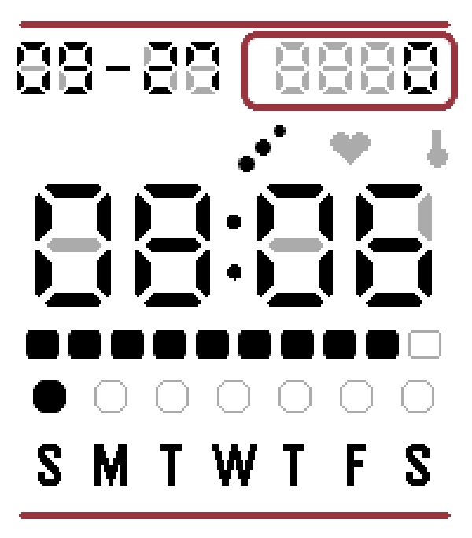
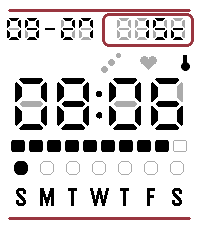
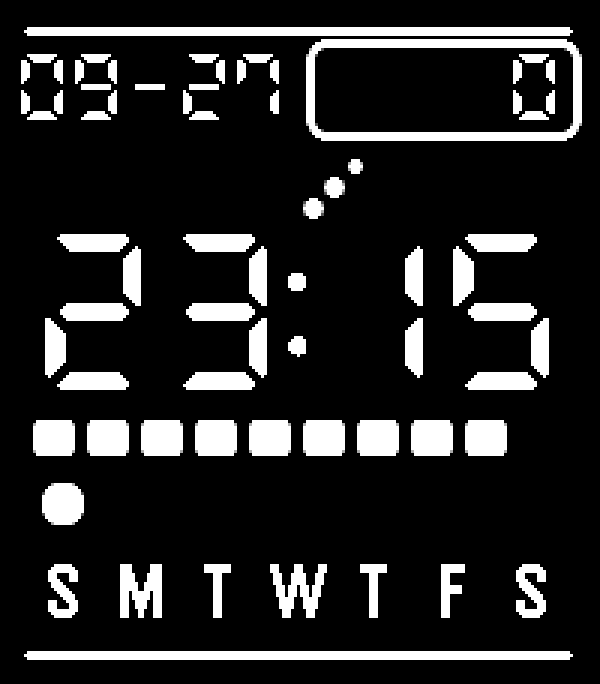

# CrystalTick

A retro Casio/LCD-style watchface for the **Pebble Time 2** (emery), inspired by
[Quartz by Dalpek](https://apps.repebble.com/quartz-by-dalpek_31cfe29ecd814df4b5ca8bb4) but built
from scratch, with a live-updating heart-rate complication and two screen-care features aimed at
reducing LCD burn-in from long-held static elements: automatic night-time color inversion and a
daily anti-burn-in pixel shift.

See [`docs/design.md`](docs/design.md) for the full design rationale — the color model, the
heart-rate complication's HealthService integration, the screen-care features, and a list of
Pebble API gotchas worth knowing before touching the layout code.

## Install

- [Rebble appstore](https://apps.rebble.io/en_US/application/6ab8c66d3a48fe000ac8af5b)
- [Core Devices appstore](https://apps.repebble.com/f319e01edc884349b8da93a4)

## Screenshots

| Steps | Temperature | Night |
|---|---|---|
|  |  |  |

## Features

- Retro 7-segment LCD look (DSEG7 font) with a dim "ghost segment" background behind the time,
  complication value, and seconds — simulating a real LCD's unlit segments.
- First-row complication, shown with a 3-icon mode row beneath it: **Steps**, **Heart Rate**
  (live via HealthService — see [`docs/design.md`](docs/design.md#heart-rate)), or
  **Temperature** (via a small phone-side weather fetch, no API key required).
- Central Face Color (White/Cyan/Green/Amber — tints the LCD "glass," not the ink), Backlight
  Color (Pebble Time 2 hardware tint), Seconds Display (Show/Hide/Static "00"/Power Save — live
  only while the backlight is on), Date Format, First Day of Week — all configured from the
  phone's Clay settings page.
- **Night Auto-Invert**: swaps foreground/background colors during a configurable night window.
- **Anti Burn-in Shift**: nudges the whole display by up to 1px once a day on a deterministic
  8-day cycle.
- Weekday row: a block above each letter, filled only for today, faint outline for the rest.

## Project layout

```
crystaltick/
  package.json          # app manifest: uuid, target platform, capabilities, messageKeys, resources
  wscript                # waf build script (stock Pebble SDK template + extra strict CFLAGS)
  src/c/
    main.c               # window lifecycle, tick/battery/AppMessage wiring
    settings.h/.c         # persisted settings struct + Clay AppMessage parsing
    complication.h/.c     # steps/temperature/heart-rate value resolution + HealthService lifecycle
    screen_care.h/.c      # theme color resolution (day/night polarity, ghost tone)
    logic.h/.c            # dependency-free decision logic (unit-tested on the host)
    draw.h/.c             # all on-screen drawing
  resources/fonts/        # DSEG7 "ClassicMini" font (SIL OFL 1.1) - weekday letters use a
                           # system font instead, see docs/design.md
  src/pkjs/
    config.js             # Clay settings page schema
    index.js               # Clay wiring + Open-Meteo weather fetch
  tests/test_logic.c       # host-compiled unit tests for logic.c
  scripts/                 # lint / static-analysis / coverage helpers (see below)
  docs/                     # design notes and dev environment setup
```

## Building and testing

Requires the [Pebble SDK](https://developer.repebble.com/sdk/) (`pebble` CLI) and Node.js/npm.
On an immutable/atomic Linux host, run all of this inside a `toolbox` (or any container) rather
than on the host directly — see [`docs/dev-environment.md`](docs/dev-environment.md).

```bash
npm install                    # installs @rebble/clay and eslint
npm run build                  # pebble build -> build/crystaltick.pbw
npm test                       # host-compiled unit tests for the pure decision logic
npm run lint                   # clang-format check + cppcheck + eslint
npm run format                 # clang-format -i (auto-fix)
npm run coverage               # gcov line-coverage report for logic.c
npm run coverage:html          # same, as a browsable HTML report (needs lcov)
```

Run in the emulator:

```bash
pebble install --emulator emery
pebble screenshot --no-open --emulator emery screenshot_emery.png
```

Run on a real Pebble Time 2, over your phone's developer connection (Pebble app → Settings →
Developer):

```bash
pebble install --phone <phone-ip>
pebble logs --phone <phone-ip>
pebble screenshot --no-open --phone <phone-ip> out.png
```

## Platform

Pebble Time 2 (`emery`, 200x228, rectangular, 64-color) only in this pass. Pebble Round 2
(`gabbro`, 260x260, round) is a natural follow-up but needs its own circular layout — see
[`docs/design.md`](docs/design.md#follow-ups-not-in-this-pass).

## License

[GNU AGPLv3](LICENSE). The bundled DSEG7 font is separately licensed under the SIL Open Font
License 1.1 — see [`resources/fonts/DSEG-LICENSE.txt`](resources/fonts/DSEG-LICENSE.txt).

## Credits

- Inspired by [Quartz by Dalpek](https://apps.repebble.com/quartz-by-dalpek_31cfe29ecd814df4b5ca8bb4).
- DSEG font by [Keshikan](https://github.com/keshikan/DSEG) (SIL OFL 1.1).
